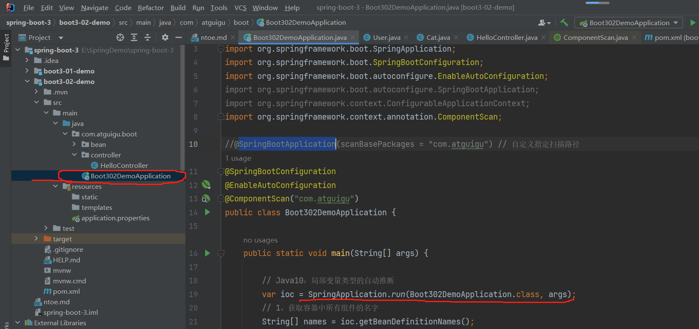
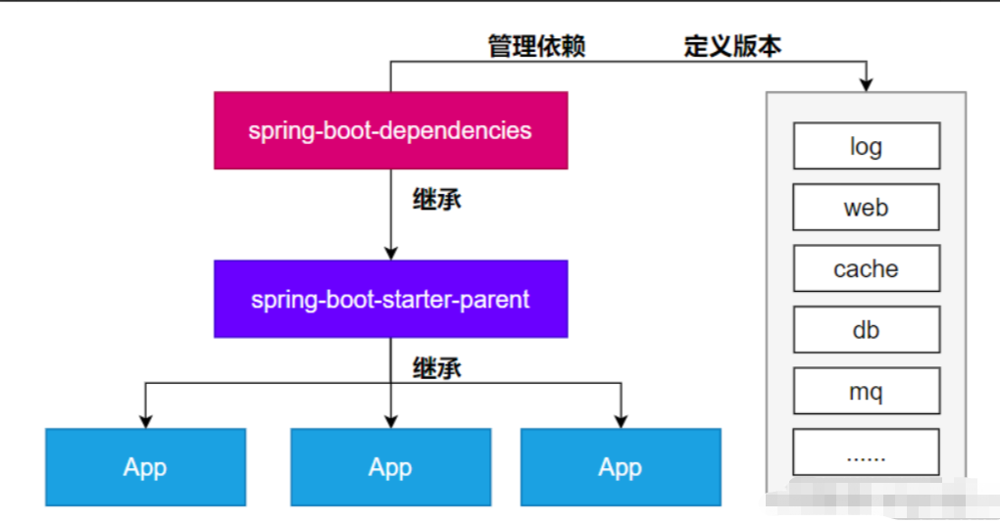

# SrpingBoot3

---
## 1. 项目新建
* 直接建Maven项目
* 通过官方提供的Spring Initializr项目创建


## 2. 相关pom依赖

```xml
    <!--    所有springboot项目都必须继承自 spring-boot-starter-parent -->
        <parent>
            <groupId>org.springframework.boot</groupId>
            <artifactId>spring-boot-starter-parent</artifactId>
            <version>3.0.5</version>
        </parent>

        <dependencies>
    <!--        web开发的场景启动器 -->
            <dependency>
                <groupId>org.springframework.boot</groupId>
                <artifactId>spring-boot-starter-web</artifactId>
            </dependency>
        </dependencies>

    <!--    SpringBoot应用打包插件-->
        <build>
            <plugins>
                <plugin>
                    <groupId>org.springframework.boot</groupId>
                    <artifactId>spring-boot-maven-plugin</artifactId>
                </plugin>
            </plugins>
        </build>
```


## 3. 依赖管理机制


### 导入 starter 所有相关依赖都会导入进来
* 需要开发什么场景就导入什么场景启动器
* Maven依赖传递原则。A-B-C，A依赖B，B依赖C，则A也依赖了C
* 导入场景启动器，场景启动器会自动把这个场景的所有核心依赖全部导入进来

### 为什么版本号都不用写？
* 每个boot项目都有一个父项目 spring-boot-starter-parent
* parent的父项目是 spring-boot-dependencies
* 父项目具有 版本仲裁中心，会把所有常见的jar的依赖版本都声明好了，例如：mysql-connector-j

### 如何自定义版本号
* 利用maven的就近原则
  * 直接在当前项目properties标签中声明父项目的版本属性的key
  * 直接在导入依赖的时候声明版本

### 第三方的jar包
* boot父项目没有管理的需要自行声明好，例如：

```xml
    <!-- https://mvnrepository.com/artifact/com.alibaba/druid -->
    <dependency>
        <groupId>com.alibaba</groupId>
        <artifactId>druid</artifactId>
        <version>1.2.16</version>
    </dependency>
```


## 4. 自动配置机制

* 自动配置的 Tomcat、SpringMVC 等
  * 导入场景，容器中就会自动配置好这个场景的核心组件。
  * 以前：DispatcherServlet、ViewResolver、CharacterEncodingFilter....
  * 现在：自动配置好的这些组件
* 验证：容器中有了什么组件，就具有什么功能

```java
public class Boot302DemoApplication {
  public static void main(String[] args) {
    // Java10：局部变量类型的自动推断
    var ioc = SpringApplication.run(Boot302DemoApplication.class, args);
    // 1、获取容器中所有组件的名字
    String[] names = ioc.getBeanDefinitionNames();
    // 2、遍历查看
    // SpringBoot把以前配置的核心组件现在都自动配好了
    for (String name:
            names) {
      System.out.println(name);
    }
  }
}
```

* 默认扫描规则
  * @SpringBootApplication 标注的累就是主程序类
  * <font color=red>SpringBoot只会扫描主程序所在的包及其下面的子包</font>，自动的componet-scan功能
  * 自定义扫描路径
    * @SpringBootApplication(scanBasePackages = "com.xxx") 指定即可
    * @ComponentScan("com.xxx") 直接指定扫描的路径

* 配置默认值
  * 配置文件的所有配置项是和某个类的对象值进行一一绑定
  * 绑定了配置文件中每一项值的类：配置属性类
  * 比如：
    * ServerProperties类绑定了所有Tomcat服务器有关的配置
    * MultipartProperties类绑定了所有文件上床相关的配置
    * .....参照[官方文档](https://docs.spring.io/spring-boot/docs/current/reference/html/application-properties.html#appendix.application-properties) 或者参照绑定的属性类

* 按需加载自动配置
  * 导入场景<font color=red>spring-boot-starter-web
    * 场景启动器除了会导入相关功能依赖，导入一个spring-boot-starter，是所有starter的starter，基础核心starter
    * spring-boot-starter导入了一个包 spring-boot-autoconfigure。包里面都是各种场景的AutoConfiguration自动配置类
    * 虽然全场景的自动配置都在 spring-boot-autoconfigure这个包，但是不是全都开启的。
    * 导入哪个场景就开启哪个自动配置

**总结**：<font color=red> 导入场景启动器、触发 spring-boot-autoconfigure这个包的自动配置生效、容器中就会具有相关场景的功能</font>


